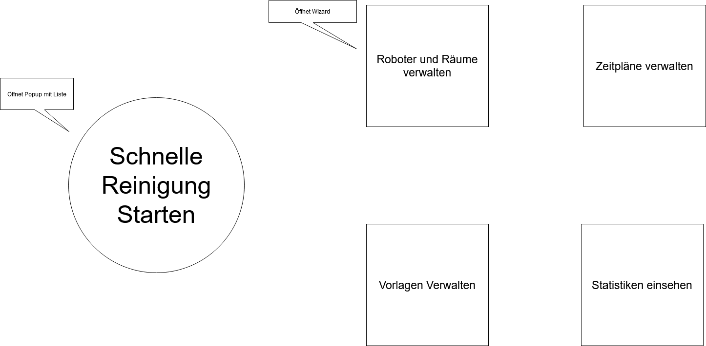
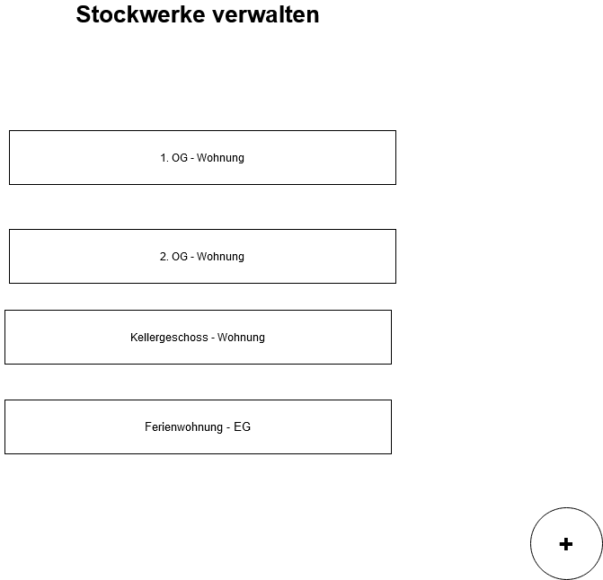
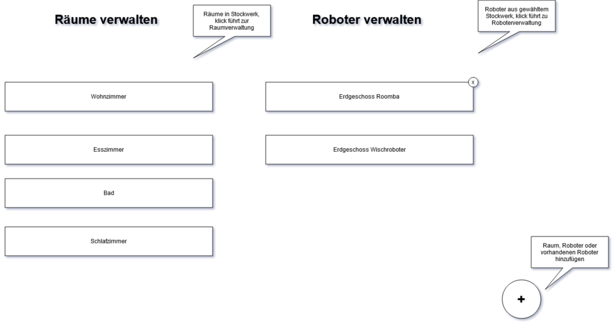
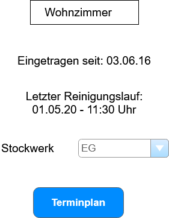
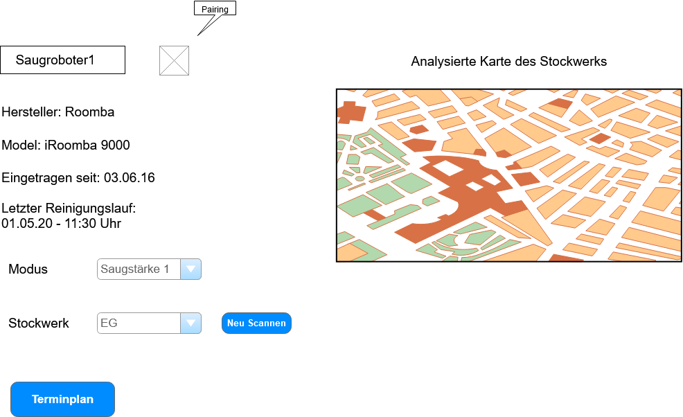
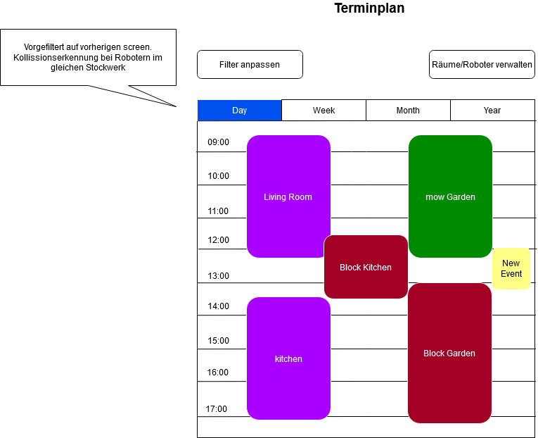
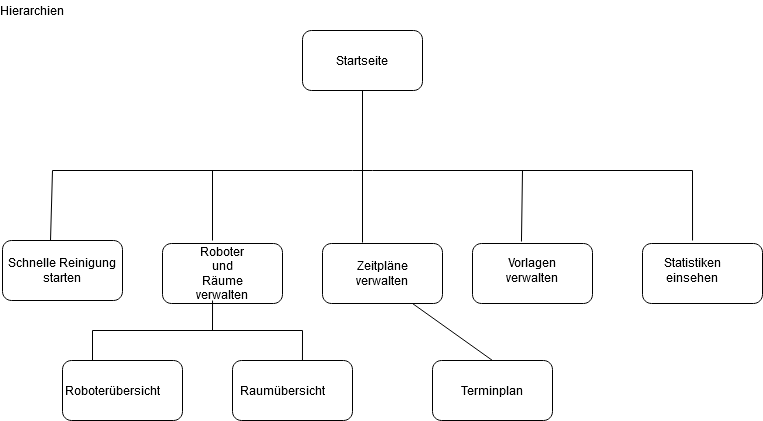

# Reinigungsmanager

## Chancen und Risiken

Bisher ist der Markt sehr Hersteller spezifisch. Alle bieten ihre eigenen Verwaltungstools an. Dieses Projekt, bietet die Möglichkeit für die Nutzer auf eine Einheitliches Konfigurations Tool
aufzubauen. Die Gefahr besteht darin, dass die Hersteller Angst haben ihr Alleinstellungsmerkmal und damit ihren Business Case zu verlieren. Hierzu können die Hersteller proprietär Protokolle verwenden.

In einer perfekten Welt würden die Hersteller aber solche Tools unterstützen.

## Personas
### Persona 1: Birgit

52, Weiblich, Ernährungsberaterin, 30000€ brutto/Jahr
In besitz eines Android Tablets und eines Desktop PCs.
Sehr geringe technische Kenntnisse. (Absuchen der GUI/Tastatur durch langsames abfahren mit dem Zeigefinger)

#### Vorkenntnisse:
Nutzt das tablet gelegentlich für Spiele oder das checken von E-Mails.
Computer findet nur für das arbeiten in Word seltenen gebrauch.
#### Ziel:
Möchte mit der reinigungs Website den Zeitlichen Ablaufplan der verschiedenen Reinigungshelfer Steuern.

#### Annahmen:
Das einrichten aller kompatiblen Geräte kann durch einscannen eines QR codes in der Anleitung o.Ä. der Reinigungshelfer geschehen.
\newpage
### Persona 2: Karl

38, Mänlich, Informatiker, 55000€ brutto/Jahr
In besitz eines Android Tablets, eines Laptops und eines Desktop PCs.
Sehr hohe technische Kenntnisse. (Sitzt jeden Tag für viele Stunden am PC, kennt sich mit Websiten aus) 

#### Vorkenntnisse:
Nutzt das Tablet zum weiterinformieren / lesen von Dokumenten
Sitzt jeden Tag viele Stunden am PC um seine arbeit zu erldedigen
#### Ziel:
möchte, da er viel von Zuhause arbeitet Arbeitsbereiche blokieren.
#### Annahmen:
Das einrichten der Geräte kann über eine geleitete Website erfolgen. Die weitere Konfigurationsmöglichkeiten anbietet.

### Persona 3: Herr und Frau Dagobert

Herr und Frau Dagobert sind mittleren Alters und vermieten voll beruflich Ferienwohnungen, verteilt auf drei Häusern mit 2 Stockwerken in der historischen Innenstadt. Die Einnahmen decken gerade so die Betriebskosten, das Budget für eine Reinigungskraft ist begrenzt, sodass Frau Dagobert, trotz ihres Rentneralters, die Wohnungen größtenteils selbst reinigt, und neben her auch noch den Kundenkontakt pflegt. Herr Dagobert kümmert sich um den modernen Ausbau der Wohnungen und die Pflege des Innenhofs.

#### Vorkentnisse:

Herr und Frau Dagobert sind beide durchnittliche verbraucher technischer Geräte, sie verwenden beide regelmäßig ihr Smartphone, Tablet oder Computer, hauptsächlich aber für verwaltungsaufgaben ihrer Immobilien. Der Sohn von Herr und Frau Dagobert ist Informatiker in einer etwas weiter entfernten Stadt. Wenn er zu Besuch da ist, kümmert er sich um die Einrichtung. Er hat auch schon das Geländeüberspannende WiFi eingerichtet und erklärt auch mal das ein oder andere per Telefon. Ansonsten sind Herr und Frau Dagobert mit der alltäglichen Bedienung auf sich gestellt. Der Sohn fände es toll, wenn er dank einer API den Reinungungsplan mit der Buchungssoftware synchronisieren könnte.
#### Ziele:

Frau Dagobert möchte einen Wisch- und Saugroboter einsetzen um ihren gestressten Alltag etwas zu erleichtern. Herr Dagobert möchte einen Mähroboter für die Grünflächen des Innenhofs und des Gartens anschaffen.

Wichtig ist ihnen, dass ihre Kunden nicht gestört werden. Der Reinigungsplan, wird mit dem Belegungsplan der Wohnungen genau abgestimmt. Da die Häuser historische Altbauten sind muss der Saugroboter von der einen Etage in die andere getragen werden, Frau Dagobert möchte dazu Benachrichtigt werden.

Die Kunden erwarten eine moderne Ausstattung der Ferienwohnungen, dazu gehört auch eine moderne Hausautomatisierung. Die Kunden sollen aber nur die Geräte in ihrer Wohnung steuern können, der Reinigungsplan soll nur für Herr und Frau Dagobert sichtbar sein.

Herr und Frau Dagobert möchten das Heimautomatisierungsportal von überall aus mit einem Tablet erreichen. Das wäre besonders praktisch, da ihre vielseitigen Tätigkeiten über das gesamte Gelände verteilt sind. Abends arbeiten sie am PC und finden es toll, wenn sie nicht das Gerät wechseln müssen. Auch ihr Sohn fänd es praktisch, wenn er per VPN einfach auf die Webseite zugreifen kann.

## Storyboards
> 

*Startseite*

> 

*Stockwerke Verwalten*

> 

*Räume und Roboter des Stockwerks verwalten*

> 

*Übersichtsseite - Raum*

> 

*Übersichtsseite - Roboter*

> 

*Kalender zur Terminpflege*

## Tabellen

> 

*Applikationshierarchie*